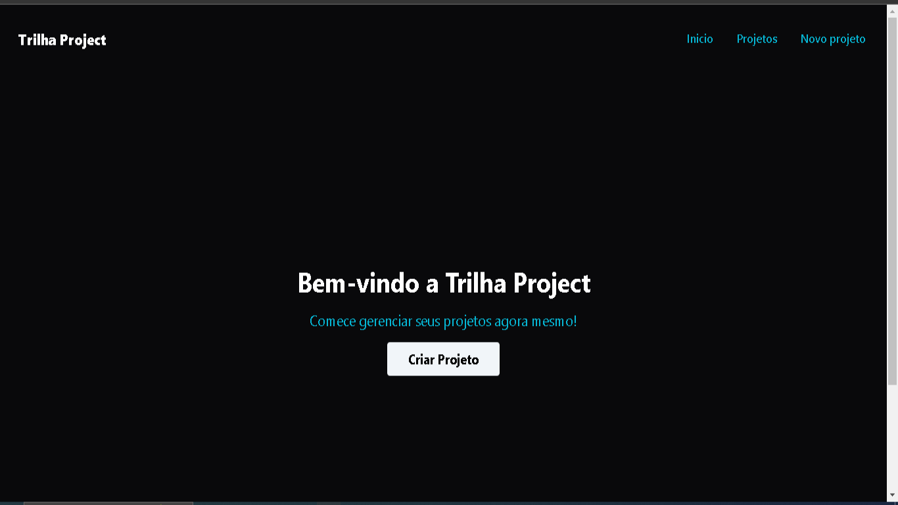

## Preview

 

## 💻Projeto

Bem-vindo ao meu projeto de gerenciamento de projetos! Controle e organize suas iniciativas de forma fácil e eficiente, visualize detalhes importantes, como nome, categoria, orçamento e serviços associados. Edite e gerencie seus projetos de maneira simplificada. Explore e simplifique sua gestão de projetos conosco!

## 🔨Funcionalidades do projeto

- Visualização de Dados do Projeto: Apresenta informações essenciais do projeto, como nome, categoria, orçamento e custo atual.

- Edição de Dados do Projeto: Permite a edição de detalhes do projeto, como nome, categoria e orçamento.

- Adição de Serviços: Facilita a inclusão de novos serviços, considerando custos e respeitando o orçamento.

- Remoção de Serviços: Oferece a capacidade de remover serviços associados ao projeto.

- Armazenamento Local: Utilização do armazenamento local para preservar dados entre sessões.

## 🚀Tecnologias

Esse foi desevolvido com as seguintes tecnologias :

- React JS
- Tailwind CSS

## 🤵Autor

 
Feito por <a href="https://github.com/guilhermeHenrique08">Guilherme Henrique 🚀</a>

## 📝 Licença

Este projeto esta sobe a licença [MIT](./LICENSE).
Feito com ❤️ por Guilherme 👋🏽 [Entre em contato!](https://www.linkedin.com/in/dev-guilherme-marques/)
